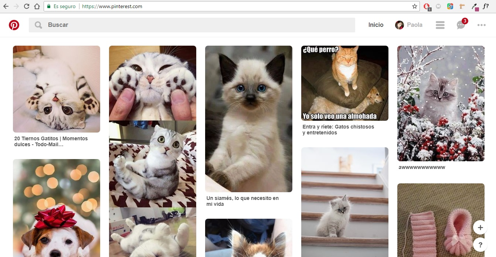

# Reto N° 1
## Objetivo

Explicar qué partes conforman el UX y qué partes el UI de una pagina web

## Pinterest

UX

* La opcion de registrarse como nuevo usuario de Pinterest con una cuenta de correo y contraseña, o poder elegir
  una cuenta de facebook o de google.

* La opcion de recuperar contraseña.

UI

* Diseño de botones, con colores caracteristicos  de  facebook o otro boton  con colores caracteristicos de una 
  cuenta de google.

* Diseño del cuadro donde se ingresa correo electronico y contraseña.
 

  

UX

 * La opcion de editar perfil
 
 
 * La opción de busqueda de una imagen que el usuario desea.

 * La opcion de mostrar las notificaciones de escritorio para que el usuario esté al tanto de ellas.
 
 * La exixstencia de un boton  de inicio para retornar al principio de Pinterest

 * Mostrar en una lista todos los temas que tienes Pinterest, con sus respectivas imagenes.

 * Mostrar un sub-menú con imagenes recomendadas

 * Mandar mensajes a amigos.

 * Intercambiar imágenes y compartirlas.

 * Opciones de configuración de cuenta.

 * Crear widget

 
 
 
 UI

 * Los colores del logo rojo y blanco.

 * Diseño de la barra de buscador.

 * La forma y tamaño de las imágenes.

 * Color de los botones de navegación.

 * Disposición en columnas de las imágenes.

 * Una imagen del usuario logueado.
 
 * Diseño de los botones
 
 
 UX
 
 * Opcion de enviar imagenes por fb, twitter y whatapp o correo.
 
 * Guardar imágenes que te gustan.
 
 * Opcion de agregar comentarios a una imagen.
 
 * Sugerir mas imagenes.
 
 * Opcion de visitar la pagina de origin de la imagen
 
 UI
 
 * Diseño de boton guardar con el color caracteristico de rojo y blanco.
 
 * Diseño donde se escribira el comentario.
 
 * Diseño de menu desplegable para enviar imagen por facebook, twitter,whatapp o correo
 
 
 UX
 
 * Organizar las imagenes en tableros, con respectivos nombres
 
